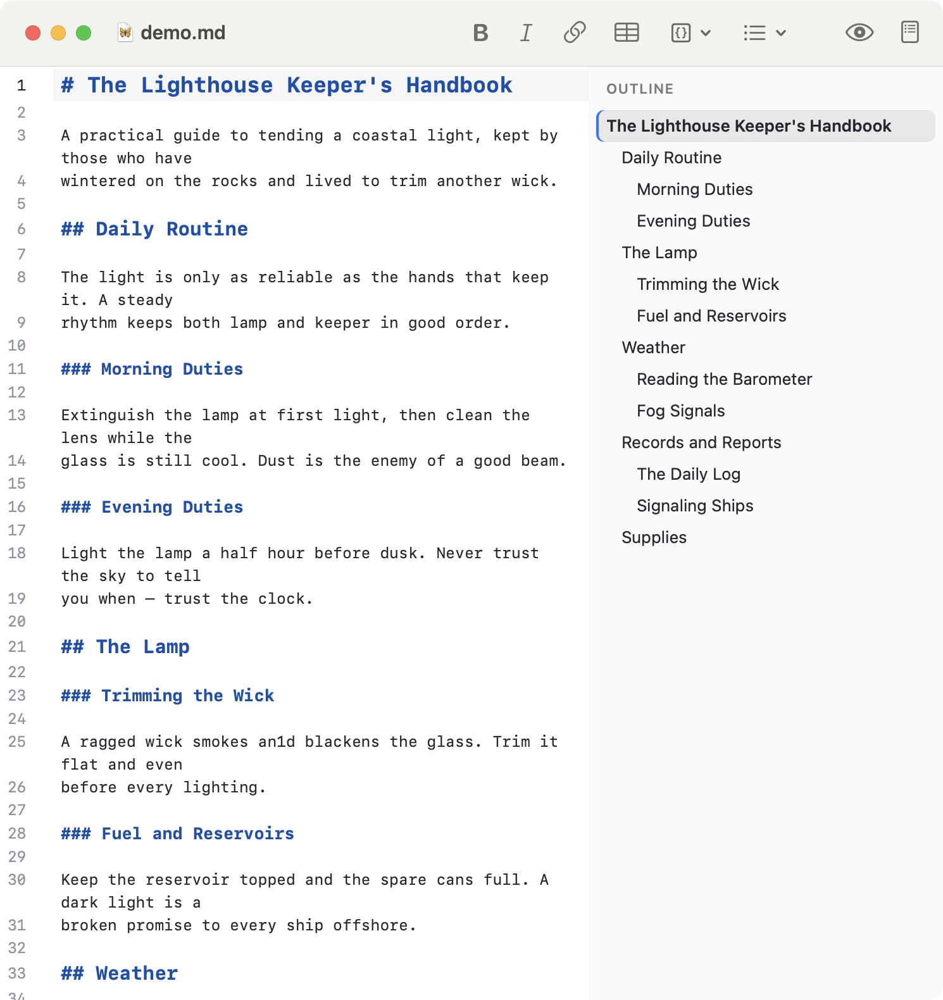
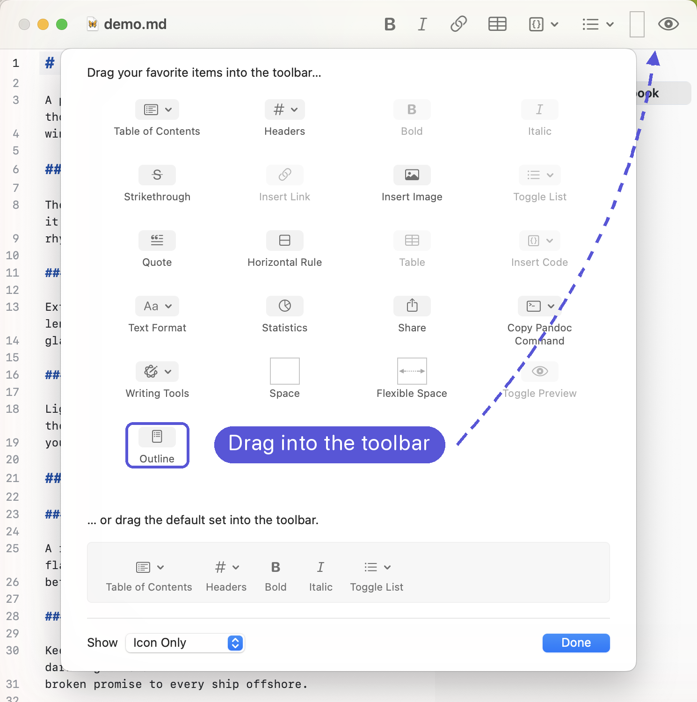

# MarkEdit Outline Sidebar

A table-of-contents / outline **sidebar** for [MarkEdit](https://github.com/MarkEdit-app/MarkEdit).

MarkEdit features a Table of Contents as an optional **toolbar popover** (⇧⌘O). This extension is similar, but makes a persistent **sidebar** you can show or hide, that highlights your current section, and lets you jump around the document by clicking headings in both **edit** and **preview** modes.



**[⬇ Download the latest release](https://github.com/Nigelw/MarkEdit-outline-sidebar/releases/latest)** — then see [Install](#install) below.

## Features

- **Sidebar** listing every heading, indented by level, with the current section highlighted.
- **Dock left or right**: position the sidebar on either side of the window.
- **Resizable**: drag the divider to resize it.
- **Click to navigate**: clicking a heading scrolls the editor to it and moves the caret there.
- **Live updates**: the outline rebuilds as you type (debounced) and re-highlights as you move around.
- **Preview mode support**: when the [MarkEdit-preview](https://github.com/MarkEdit-app/MarkEdit-preview) extension is showing a preview, clicking a heading scrolls the rendered preview to the matching heading and briefly highlights it. This works whether preview's syncScroll setting is enabled or disabled.
- **Restores state**: the extension remembers whether the sidebar was open or closed, which side it's docked to, and how wide it is across app launches.
- **Multiple ways to toggle**: a keyboard shortcut, an Extensions menu command, and an optional **native toolbar button** (see *Toggling* below).
- **Theme-aware**: the panel reads colors from the live editor theme, so it matches MarkEdit's light, dark, and custom themes automatically.
- **Keeps itself up to date**: checks GitHub for new versions and can install them for you (see *Staying up to date* below).

## Install

**Download:** Download the [latest release](https://github.com/Nigelw/MarkEdit-outline-sidebar/releases/latest) and copy `markedit-outline.js` into MarkEdit's scripts folder:

```
~/Library/Containers/app.cyan.markedit/Data/Documents/scripts/
```

then relaunch MarkEdit. After that the extension [keeps itself up to date](#staying-up-to-date) — no need to download it again by hand.

**From source:**

```sh
npm install
npm run build     # builds dist/ and copies it into the scripts folder
npm run reload    # quit + relaunch MarkEdit to load the new build
```

See the [MarkEdit Customization guide](https://github.com/MarkEdit-app/MarkEdit/wiki/Customization) for how user scripts are loaded.

## Toggling the sidebar

The extension exposes the toggle three ways:

1. **Keyboard shortcut** — **⇧⌘L** by default (configurable).
2. **Menu command** — *Extensions → Outline Sidebar → Toggle Outline Sidebar*.
3. **Native toolbar button** — a real macOS toolbar item (see below).

### Adding the toolbar button

**The easy way:** run *Extensions → Outline Sidebar → **Add Toolbar Button to settings.json…***. It merges the entry into your `settings.json` (leaving any existing items intact). Then:

1. **Restart MarkEdit.**
2. **View → Customize Toolbar…** and drag the **Outline** item into the toolbar.



*Remove Toolbar Button…* reverses the settings change (then drag it back out via Customize Toolbar).

**The manual way:** add this to `settings.json` yourself instead of using the menu command:

```jsonc
"editor.customToolbarItems": [
  {
    "title": "Outline",
    "icon": "list.bullet.rectangle.portrait",
    "actionName": "Toggle Outline Sidebar"
  }
]
```

If you want to customize the toolbar icon, `icon` can be set to any [SF Symbol](https://developer.apple.com/sf-symbols/) name.

## Positioning

The sidebar can dock to either edge of the window. Switch sides from *Extensions → Outline Sidebar → **Dock Left** / **Dock Right***; it writes your choice to `settings.json` and prompts a restart to apply. You can also set it directly with the `position` setting below.

Resize the sidebar by dragging the divider between it and the editor — the width is remembered automatically.

## Highlighting

The current section is highlighted in the outline as you move through the document. There are two highlighting modes, switchable live from *Extensions → Outline Sidebar → **Highlight Follows Scroll** / **Highlight Follows Insertion Point*** (or with the `highlightMode` setting below):

- **Follows Scroll** *(default)* — the highlight tracks the section you're viewing, following the editor or preview as you scroll.
- **Follows Insertion Point** — the highlight tracks the section your cursor is in while editing. In preview there's no cursor, so it still follows the scroll position.

## Configuration

Add an `extension.markeditOutlineSidebar` object to your MarkEdit [`settings.json`](https://github.com/MarkEdit-app/MarkEdit/wiki/Customization#advanced-settings) (in the same `Documents` folder). The `extension.` prefix is required by MarkEdit's [settings schema](https://github.com/MarkEdit-app/schemas). All fields are optional:

```jsonc
{
  "extension.markeditOutlineSidebar": {
    "position": "right",          // "right" | "left" — which edge to dock to
    "onLaunch": "remember",        // "remember" last state | "open" always | "closed" always
    "highlightMode": "scroll",     // "scroll" follows the view | "insertionPoint" follows the cursor
    "shortcut": { "key": "l", "modifiers": ["Command", "Shift"] },
    "update": "notify"             // "automatic" | "notify" | "never" — see Staying up to date
  }
}
```

`shortcut.modifiers` may include `"Command"`, `"Shift"`, `"Control"`, and `"Option"`. The default is **⇧⌘L** because ⇧⌘O is already used by MarkEdit's built-in Table of Contents toolbar item.

## Staying up to date

The extension checks its [GitHub releases](https://github.com/Nigelw/MarkEdit-outline-sidebar/releases) for a newer version shortly after MarkEdit launches (at most once a day), and any time you run *Extensions → Outline Sidebar → **Check for Updates…***. When a newer release is found it can install the new build by replacing its own script file; the new version takes effect the next time you launch MarkEdit.

The `update` setting controls how this behaves:

| Value         | Behavior |
| ------------- | -------- |
| `"automatic"` | Download and install new versions silently, then let you know to restart. |
| `"notify"`    | **(default)** Tell you when an update is available and ask before downloading. You can update now, skip that version, or be reminded later. |
| `"never"`     | Don't check automatically. You can still check by hand with the menu command. |

Skipping a version in `notify` mode means you won't be prompted for it again, though a later release will still be offered. *Check for Updates…* always checks regardless of the setting, and tells you when you're already up to date.

> The updater downloads builds directly from this project's public GitHub repository over HTTPS. If you'd rather manage updates yourself, set `update` to `"never"`.

## Contributing

Developer and architecture notes — how the extension works internally, the project layout, and the release process — live in [AGENTS.md](AGENTS.md).

## License

MIT
