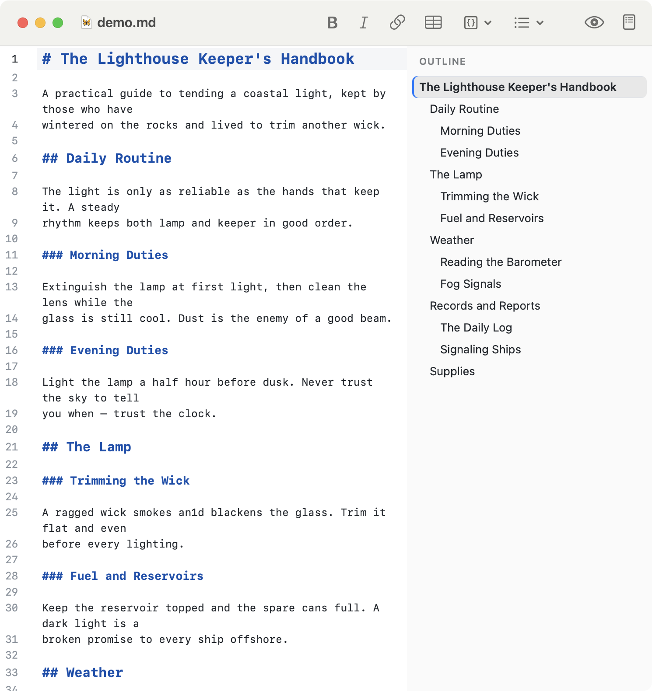
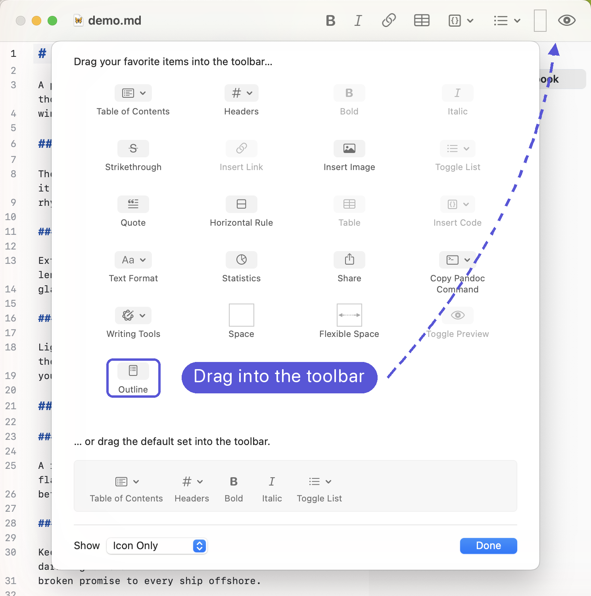

# MarkEdit Outline Sidebar

A table-of-contents / outline sidebar for [MarkEdit](https://github.com/MarkEdit-app/MarkEdit).

MarkEdit features a built-in toolbar button that displays a Table of Contents in a popover. This extension is similar, but makes the ToC a persistent sidebar you can show or hide. It highlights your current section and lets you jump around the document by clicking headings in both edit and preview modes. It also plays nicely with my [Bidirectional Preview Sync](https://github.com/Nigelw/MarkEdit-bidirectional-preview-sync) extension.



## Features

- **Sidebar** listing every heading, indented by level, with the current section highlighted.
- **Dock left or right**: position the sidebar on either side of the window.
- **Resizable**: drag the divider to resize it.
- **Click to navigate**: clicking a heading scrolls the editor to it and moves the caret there.
- **Live updates**: the outline rebuilds as you type and re-highlights as you move around.
- **Preview mode support**: when the [MarkEdit-preview](https://github.com/MarkEdit-app/MarkEdit-preview) extension is showing a preview, clicking a heading scrolls the rendered preview to the matching heading and briefly highlights it. This works whether preview's syncScroll setting is enabled or disabled.
- **Restores state**: the extension remembers whether the sidebar was open or closed, which side it's docked to, and how wide it is across app launches.
- **Multiple ways to toggle**: a keyboard shortcut, an Extensions menu command, and an optional **native toolbar button** (see *Toggling* below).
- **Theme-aware**: the panel reads colors from the live editor theme and your system’s accent color, so it matches MarkEdit's light, dark, and custom themes automatically.
- **Managed updates**: once installed from MarkEdit's Extension Manager, new versions are delivered by MarkEdit's centrally managed update system.

## Install

Install it from MarkEdit's **Extension Manager**. MarkEdit manages subsequent updates from the official extension registry.

**Or install and build from source:**

```sh
npm install
npm run build     # builds dist/ and copies it into the scripts folder
npm run reload    # quit + relaunch MarkEdit to load the new build
```

## Toggling the sidebar

The extension exposes the toggle three ways:

1. **Keyboard shortcut** — **⇧⌘L** by default (configurable).
2. **Menu command** — *Extensions → Outline Sidebar → Toggle Outline Sidebar*.
3. **Native toolbar button** — a real macOS toolbar item (see below).

### Adding the toolbar button

**The easy way:**

1. Go to Extensions → Outline Sidebar → **Add Toolbar Button to settings.json…**. This updates your `settings.json` (leaving any existing items intact).
2. **Restart MarkEdit.**
3. **View → Customize Toolbar…** and drag the **Outline** item into the toolbar.



*Remove Toolbar Button…* reverses the settings change (then drag it back out via Customize Toolbar).

**The manual way:**

Add this to `settings.json` yourself instead of using the menu command:

```jsonc
"editor.customToolbarItems": [
  {
    "title": "Outline",
    "icon": "list.bullet.rectangle.portrait",
    "actionName": "Toggle Outline Sidebar"
  }
]
```

If you want to customize the toolbar icon, `icon` can be set to any [SF Symbol](https://developer.apple.com/sf-symbols/) name.

## Positioning

The sidebar can dock to either edge of the window. Switch sides from *Extensions → Outline Sidebar → **Dock Left** / **Dock Right***; it applies immediately and writes your choice to `settings.json`. You can also set it directly with the `position` setting below.

Resize the sidebar by dragging the divider between it and the editor — the width is remembered automatically.

## Highlighting

The current section is highlighted in the outline as you move through the document. There are two highlighting modes, switchable live from *Extensions → Outline Sidebar → **Highlight Follows Scroll** / **Highlight Follows Insertion Point*** (or with the `highlightMode` setting below):

- **Follows Scroll** *(default)* — the highlight tracks the section you're viewing, following the editor or preview as you scroll.
- **Follows Insertion Point** — the highlight tracks the section your editor cursor is in, including while preview is visible.

## Configuration

Add an `extension.markeditOutlineSidebar` object to your MarkEdit [`settings.json`](https://github.com/MarkEdit-app/MarkEdit/wiki/Customization#advanced-settings) (in the same `Documents` folder). The `extension.` prefix is required by MarkEdit's [settings schema](https://github.com/MarkEdit-app/schemas). All fields are optional:

```jsonc
{
  "extension.markeditOutlineSidebar": {
    "position": "right",          // "right" | "left" — which edge to dock to
    "onLaunch": "remember",        // "remember" last state | "open" always | "closed" always
    "highlightMode": "scroll",     // "scroll" follows the view | "insertionPoint" follows the cursor
    "shortcut": { "key": "l", "modifiers": ["Command", "Shift"] }
  }
}
```

`shortcut.modifiers` may include `"Command"`, `"Shift"`, `"Control"`, and `"Option"`. The default is **⇧⌘L** because ⇧⌘O is already used by MarkEdit's built-in Table of Contents toolbar item.

## Contributing

Developer and architecture notes — how the extension works internally, the project layout, and the release process — live in [AGENTS.md](AGENTS.md).

## License

MIT
